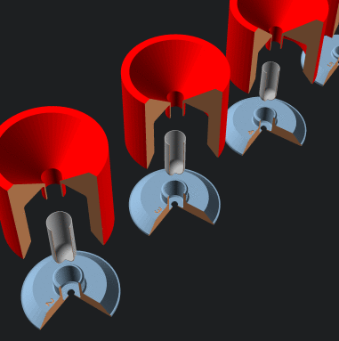
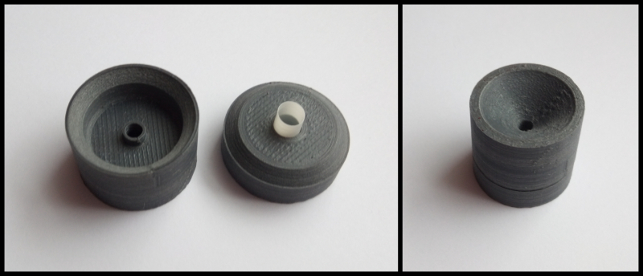

# Capsule Filler

3D printable tool to fill individual capsules with funnel, in all sizes from
000 to 5. So one can make their own food supplement capsules in small
quantities (those 100+ hole fillers 🤦) and with precission.

(Photo is of slightly older version. Printed with 100µm FDM,
material ASA, 20% infill, by [these guys](https://www.sgd3d.co.uk/).)

Code is parametric, so one should be able to easily adapt to ones needs.

## Ideas/principles

* Tolerances so that capsules within specified tolerances can be worked with.
* Should be printable with little to no support material.
* Hole on the bottom so that capsule won't get stuck by pressure (inspired by Thingverse's thing).
* Should be lightweight enough to be used on milligram scale.
  (They are more precise further from 0g, so it can also serve as additional weight.)
* Should be easy to clean (no sharp inner angles).

## Inspiration/alternatives

* https://www.torpac.com/funnels.htm - beautiful, metal, hard to get though.
* https://www.thingiverse.com/thing:3027247 - Nice, but only two sizes provided.
